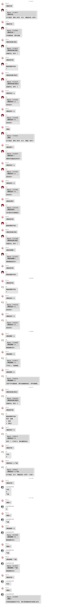

<div align="center">
  <a href="https://v2.nonebot.dev/store"></a>
  <br>
  <p></p>
</div>

<div align="center">

# nonebot_plugin_random_draw

_✨ NoneBot 随机抽取设定内容 插件 ✨_


<a href="https://github.com/Ikaros-521/nonebot_plugin_random_draw/stargazers">
    
</a>
<a href="https://github.com/Ikaros-521/nonebot_plugin_random_draw/issues">
    
</a>
<a href="https://github.com/Ikaros-521/nonebot_plugin_random_draw/network">
    
</a>
<a href="./LICENSE">
    
</a>
<a href="https://pypi.python.org/pypi/nonebot_plugin_random_draw">
    
</a>
<a href="https://www.python.org">
    
</a>

</div>

## 📖 介绍

通过添加各种想要抽取的内容，最后进行随机抽取。  

## 🔧 开发环境
Nonebot2：2.0.0rc3  
python：3.8.13  
操作系统：Windows10（Linux兼容性问题不大）  
编辑器：VS Code  

## 💿 安装  

### 1. nb-cli安装

在你bot工程的文件夹下，运行cmd（运行路径要对啊），执行nb命令安装插件，插件配置会自动添加至配置文件  
```
nb plugin install nonebot_plugin_random_draw
```

### 2. 本地安装

将项目clone到你的机器人插件下的对应插件目录内（一般为机器人文件夹下的`src/plugins`），然后把`nonebot_plugin_random_draw`文件夹里的内容拷贝至上一级目录即可。  
clone命令参考（得先装`git`，懂的都懂）：
```
git clone https://github.com/Ikaros-521/nonebot_plugin_random_draw.git
``` 
也可以直接下载压缩包到插件目录解压，然后同样提取`nonebot_plugin_random_draw`至上一级目录。  
目录结构： ```你的bot/src/plugins/nonebot_plugin_random_draw/__init__.py```  


### 3. pip安装
```
pip install nonebot_plugin_random_draw
```  
打开 nonebot2 项目的 ```bot.py``` 文件, 在其中写入  
```nonebot.load_plugin('nonebot_plugin_random_draw')```  
当然，如果是默认nb-cli创建的nonebot2的话，在bot路径```pyproject.toml```的```[tool.nonebot]```的```plugins```中添加```nonebot_plugin_random_draw```即可  
pyproject.toml配置例如：  
``` 
[tool.nonebot]
plugin_dirs = ["src/plugins"]
plugins = ["nonebot_plugin_random_draw"]
``` 


## 🔧 配置


## 🎉 功能
  

## 👉 命令

### /随机抽取帮助
命令结构：```/随机抽取帮助```  
例如：```/随机抽取帮助```  
功能：返回所有命令的使用方式。  
bot返回内容：  
```
功能说明：命令列表（命令前缀自行匹配）
获取帮助：随机抽取帮助
创建随抽组，一个群可以有多个组：随抽组创建 <组名>
往指定的随抽组中添加待抽内容：随抽添加 <组号> <内容>
删除指定随抽组中的待抽内容：随抽删除 <组号> <内容>
删除指定组号的随抽组：随抽组删除 <组号>
查看本群所有的随抽组内容（含组号和组名）：随抽组列表
查看指定组号的所有待抽内容：随抽列表 <组号>
在指定随抽组中随机抽取一个待抽内容：随抽 <组号>
清空本群中所有的随抽组（慎用）：随抽组清空
清空指定随抽组中所有的待抽内容（慎用）：随抽清空 <组号>
```

### 其他命令懒得写了，直接看图吧


## ⚙ 拓展
 

## 📝 更新日志

<details>
<summary>展开/收起</summary>

### 0.0.1

- 插件初次发布  

</details>

## 致谢
- [nonebot-plugin-template](https://github.com/A-kirami/nonebot-plugin-template)

## 项目打包上传至pypi

官网：https://pypi.org，注册账号，在系统用户根目录下创建`.pypirc`，配置  
``` 
[distutils] 
index-servers=pypi 
 
[pypi] repository = https://upload.pypi.org/legacy/ 
username = 用户名 
password = 密码
```

### poetry

```
# 参考 https://www.freesion.com/article/58051228882/
# poetry config pypi-token.pypi

# 1、安装poetry
pip install poetry

# 2、初始化配置文件（根据提示填写）
poetry init

# 3、微调配置文件pyproject.toml

# 4、运行 poetry install, 可生成 “poetry.lock” 文件（可跳过）
poetry install

# 5、编译，生成dist
poetry build

# 6、发布(poetry config pypi-token.pypi 配置token)
poetry publish

```

### twine

```
# 参考 https://www.cnblogs.com/danhuai/p/14915042.html
#创建setup.py文件 填写相关信息

# 1、可以先升级打包工具
pip install --upgrade setuptools wheel twine

# 2、打包
python setup.py sdist bdist_wheel

# 3、可以先检查一下包
twine check dist/*

# 4、上传包到pypi（需输入用户名、密码）
twine upload dist/*
```
