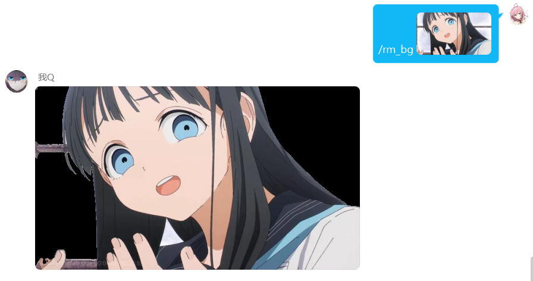

<div align="center">
  <a href="https://v2.nonebot.dev/store"></a>
  <br>
  <p></p>
</div>

<div align="center">

# nonebot_plugin_remove_bg
  
_✨ NoneBot 基于remove.bg的图片背景消除插件 ✨_
  
<a href="https://github.com/Ikaros-521/nonebot_plugin_remove_bg/stargazers">
    
</a>
<a href="https://github.com/Ikaros-521/nonebot_plugin_remove_bg/issues">
    
</a>
<a href="https://github.com/Ikaros-521/nonebot_plugin_remove_bg/network">
    
</a>
<a href="./LICENSE">
    
</a>
<a href="https://pypi.python.org/pypi/nonebot_plugin_remove_bg">
    
</a>
<a href="https://www.python.org">
    
</a>

</div>

适用于nonebot2 v11的基于remove.bg的图片背景消除插件  
调用的相关API源自:[https://www.remove.bg/api#api-reference](https://www.remove.bg/api#api-reference)   

## 🔧 开发环境
Nonebot2：2.0.0b5  
python：3.8.13  
操作系统：Windows10（Linux兼容性问题不大）  
编辑器：pycharm  

## 💿 安装
环境依赖`aiohttp`库   

### 1. nb-cli安装（推荐）
在你bot工程的文件夹下，运行cmd（运行路径要对啊），执行nb命令安装插件，插件配置会自动添加至配置文件  
```
nb plugin install nonebot_plugin_remove_bg
```

### 2. 本地安装
先安装下 `aiohttp`  
```
pip install aiohttp
```
将项目clone到你的机器人插件下的对应插件目录内（一般为机器人文件夹下的`src/plugins`），然后把`nonebot_plugin_remove_bg`文件夹里的内容拷贝至上一级目录即可。  
clone命令参考（得先装`git`，懂的都懂）：
```
git clone https://github.com/Ikaros-521/nonebot_plugin_remove_bg.git
``` 
也可以直接下载压缩包到插件目录解压，然后同样提取`nonebot_plugin_remove_bg`至上一级目录。  
目录结构： ```你的bot/src/plugins/nonebot_plugin_remove_bg/__init__.py```  


### 3. pip安装
```
pip install nonebot_plugin_remove_bg
```  
打开 nonebot2 项目的 ```bot.py``` 文件, 在其中写入  
```nonebot.load_plugin('nonebot_plugin_remove_bg')```  
当然，如果是默认nb-cli创建的nonebot2的话，在bot路径```pyproject.toml```的```[tool.nonebot]```的```plugins```中添加```nonebot_plugin_remove_bg```即可  
pyproject.toml配置例如：  
``` 
[tool.nonebot]
plugin_dirs = ["src/plugins"]
plugins = ["nonebot_plugin_remove_bg"]
``` 

### 更新版本
```
nb plugin update nonebot_plugin_remove_bg
```

## 🔧 配置  

### env配置
```
# nonebot_plugin_remove_bg 官方API KEY
REMOVE_BG_API_KEY="XXXXXXXXXXXXXXXXXXXXXXXX"
```
|       配置项        | 必填 | 默认值  |                      说明                      |
|:----------------:|:----:|:----:|:----------------------------:|
| `REMOVE_BG_API_KEY` | 是 | `` | 注册官方账号申请API KEY（每月50次免费额度） |

### API KEY获取方式
访问[https://www.remove.bg/api#remove-background](https://www.remove.bg/api#remove-background)，注册账号，然后点击`Get API Key` -> ` New API Key` -> `Create API Key`。  

## 🎉 功能
基于remove.bg，上传图片调用API消除背景后返回处理后的图片  

## 👉 命令

### ①默认配置的背景消除

#### 1、先发送命令，再发送图片（命令前缀请自行替换）
先发送`/去背景`或`/rm_bg`，等bot返回`请发送需要去除背景的图片喵~`后，发送需要去除背景的图片即可。  

#### 2、命令+图片
编辑消息`/去背景[待去除背景的图片]`或`/rm_bg[待去除背景的图片]`发送即可。  
bot返回内容：  
  

#### 3、回复图片+命令
回复需要处理的图片，然后追加命令`/去背景`或`/rm_bg`发送即可。

### ②自定义配置的背景消除

#### 1、命令+图片
命令如下(命令前缀自行添加)：  
```
自定义去背景 -img <IMAGE> [-s --size -最大输出分辨率 <最大输出图像分辨率 'preview/full/auto'>] [-t --type -前景类型 <前景类型 'auto/person/product/car'>] [-tl --type_level -前景类型级别 <检测到的前景类型的分类级别 'none/1/2/latest'>]\n [-r --roi -感兴趣区域 <感兴趣区域 x1 y1 x2 y2，如'0% 0% 100% 100%'>] [-c --crop -裁剪空白区 <是否裁剪掉所有空白区域 'true/false'>] [-p --position -定位主题 <在图像画布中定位主题 'center/original/从“0%”到“100%”的一个值(水平和垂直)或两个值(水平、垂直)'>]\n [-sc --scale -缩放主体 <相对于图像总尺寸缩放主体 从“10%”到“100%”之间的任何值，也可以是“original”(默认)。缩放主体意味着“位置=中心”(除非另有说明)。>] [-ad --add_shadow -人工阴影 <是否向结果添加人工阴影 'true/false'>] [-se --semitransparency -半透明区域 <结果中是否包含半透明区域 'true/false'>]
``` 
命令起始：`自定义去背景` 或 `remove_bg`  
`-img` 必选参数，后面追加`<IMAGE>`图片（回复的话，图片就不用了）  
`-s` 可选参数 `-s`可以改成 `--size` 或 `-最大输出分辨率`，含义是最大输出图像分辨率，传参内容是`'preview/full/auto'`（3选1）  
其他的[]都是可选参数，含义和-s相同，不再赘述。  

例如：  
```
/自定义去背景 -img <IMAGE> -s 'preview'
/remove_bg -img <IMAGE> -s 'full' -r '30% 30% 60% 60%' -ad 'true'
/自定义去背景 -图片 <IMAGE> -最大输出分辨率 'preview' -前景类型 'person' -前景类型级别 '1' -感兴趣区域 '0% 0% 100% 100%' -裁剪空白区 'true' -定位主题 'center' -缩放主体 '50%' -人工阴影 'false'  -半透明区域 'false'
```

#### 2、回复图片+命令
命令与上面相同，注意必选参数`-img`，不要忘记了。  

#### 3、自定义去背景帮助
获取命令的帮助说明命令为`自定义去背景帮助` 或 `自定义去背景help`   
例如：  
```
/自定义去背景帮助
/自定义去背景help
```

## ⚙ 拓展
修改`__init__.py`中的`catch_str`等来自定义命令触发关键词。  
代码实现缝合怪，感觉很kuso，待优化（大坑）    

## 📝 更新日志

<details>
<summary>展开/收起</summary>

### 0.0.1

- 插件初次发布

### 0.0.2

- 向上兼容rc2  

### 0.1.0

- 修改原 remove_bg命令至 自定义去背景 功能（采用shell cmd的形式）。
- 原 rm_bg 和 去背景 命令，增加可以直接回复图片进行处理。

### 0.1.1

- 修复 私聊bot无法正常运行的bug

### 0.1.2

- 插件补充元信息

</details>

## 致谢

- [remove.bg](https://www.remove.bg) - API来源  

## 项目打包上传至pypi

官网：https://pypi.org，注册账号，在系统用户根目录下创建`.pypirc`，配置  
``` 
[distutils] 
index-servers=pypi 
 
[pypi] repository = https://upload.pypi.org/legacy/ 
username = 用户名 
password = 密码
```

### poetry

```
# 参考 https://www.freesion.com/article/58051228882/
# poetry config pypi-token.pypi

# 1、安装poetry
pip install poetry

# 2、初始化配置文件（根据提示填写）
poetry init

# 3、微调配置文件pyproject.toml

# 4、运行 poetry install, 可生成 “poetry.lock” 文件（可跳过）
poetry install

# 5、编译，生成dist
poetry build

# 6、发布(poetry config pypi-token.pypi 配置token)
poetry publish

```

### twine

```
# 参考 https://www.cnblogs.com/danhuai/p/14915042.html
#创建setup.py文件 填写相关信息

# 1、可以先升级打包工具
pip install --upgrade setuptools wheel twine

# 2、打包
python setup.py sdist bdist_wheel

# 3、可以先检查一下包
twine check dist/*

# 4、上传包到pypi（需输入用户名、密码）
twine upload dist/*
```